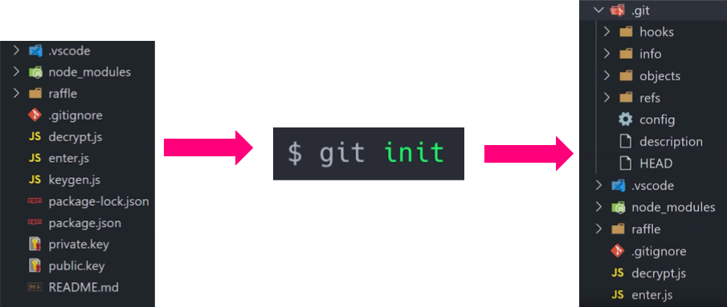
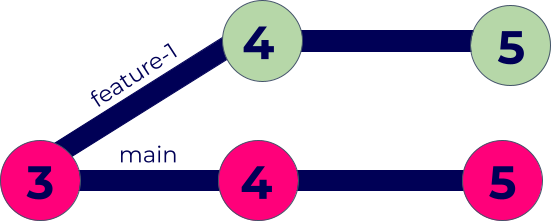
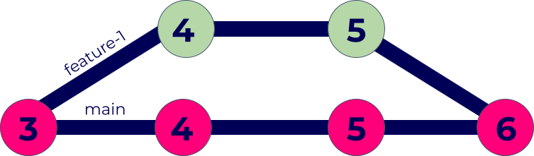
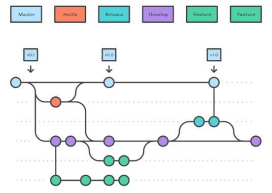

Git solves the problem of tracking changes and this is useful regardless of whether you are working in a team or not. Imagine having saves and quick saves similar to video games, but for your code. This is in essence, what git will provide. You will be able to choose which save point (or **commit** in git's case) to go back to whenever needed. It's worth noting that git is not GitLab or GitHub which use git in their core and build on top of it. For working on any code, configuration or scripts my philosophy is this: **if it's not on git, it doesn't exist**.

All following will demonstrate git using it's command line interface.

## Creating a git repository/project

To very simply add version control using git, go to the directory of your choice and use `git init`. This will create a directory name `.git/` which you will never have to touch or modify (and probably never should). In `.git/` git will store all information about changes and the project.

## Adding changes to the project

After you have made some working changes that you wish to save first use the command `git add <PATH TO FILE(S) YOU CHANGED>`

`git add` will start tracking the file(s) you specify, to save the changes use `git commit`.

`git commit` will open your default text editor, enter a message about what you changed and then git will store that **commit message**. If you wish to add a comment from the command line, use `git commit -m "<YOUR COMMIT MESSAGE>"`

But remember that you shouldn't delete other files if you wish to add changes to only a subset of files. A classmate once tried to delete all other files except the file she changed in our teams project. All unchanged files in the git project will just be there along for the ride, there is no reason to delete them. If you do delete them, then git will take that as you not needing the files any more and they will no longer be part of the project.

## Traveling in time with git

After you've made multiple commits it is possible to travel in time to older and newer commits at your will.

You can check the log of commits using: `git log`

And then you can check out the commit you wish using: `git checkout <COMMIT HASH>`

So let's say that your friend did delete some files from your project, now you can undo that reverting the commit where the files were deleted!

## Traveing in time AND space with git

Another powerful feature of git is the concept of **branches**. Creating a branch means creating another copy of your project inside the project itself with it's own change tracking. This is especially useful for just trying new changes out without breaking the code in the default branch.

Usually there is a default branch, called "main" or "master". But there can be infinite number of other branches. So imagine if you and your friend each start working on new feature: you both create a new separate branch for each feature and then start working on them while each branch tracks only the changes relevant to each feature. This way the changes don't conflict, they are on separate branches!

Branches can be created using: `git branch <NAME OF BRANCH>`

Then you can go into that branch using: `git checkout <NAME OF BRANCH>`

Then commit changes as needed while staying on that branch and the changes will not be pushed into the default branch.

Later when both are done with their feature, the branches can be **merged** back into the default branch using: `git merge`

Merging branches means taking changes from one branch and adding them to another. When two different branches change same things and are merged, there will be a **merge conflict**. To resolve the conflict, you must choose the changes from one or the other and then commit with the changes you chose.

## Example project

In a typical project you will see many different people working on many branches for type of change (feature, bug, hotfix and so on) and there will be a storm of merging going on constantly.

The best way to see a practical example would be to look at an open source project, like [QMK Firmware](https://github.com/qmk/qmk_firmware) as an example.

## Advanced git wizard tips

To make using git even easier, you can make aliases for git commands that you use often. There exist a lot of templates and existing setups that can be copied and adapted. For example with aliases you could use `gc` instead of `git commit`.

Don't forget about `.gitignore` this is another special file that is not created by default. In this text file you can specify files and directories that git should ignore. Many projects have dependencies and routines that generate some kind of output, cache, local config files or otherwise some generated files. Save repository size and use .gitignore file to specify files that should not be tracked and pushed to the repository.

Some other useful commands:

`git diff` - look at the difference between files or difference between changes or branches.

`git stash` - stashing changes saves them without commiting or adding the changes to tracking. Useful for when your changes are not finished, but you wish to quickly work on something else. Then later you can come back to the stashed changes with `git stash pop`.

`git blame` - with this command you can pinpoint who made a specific change. Most editors will have support to automatically show you who made the latest change to a line.

`git rebase` - with a rebase you can move a bunch of commits to a new base commit.

## CI/CD

I mentioned that git is not GitLab or GitHub, however at one point or another you will be using git from a platform such as those. And what these platforms usually have is some sort of Continuous Integration and Continuous Deployment (CI/CD for short) tools such as GitLab CI/CD or GitHub Actions.

CI/CD is used to automatically build, test, deploy, and monitor your applications to catch bugs and errors early in the development cycle.

Manually deploying applications is time consuming and error-prone. With CI/CD you can automate that to avoid errors and save time in the process.

On most platforms, each stage is executed by a docker container called Executor that is spawned by the Runner. After a stage is finished, the docker container for that Executor is destroyed.
