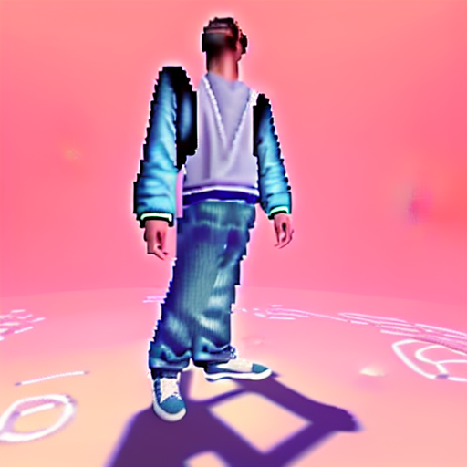
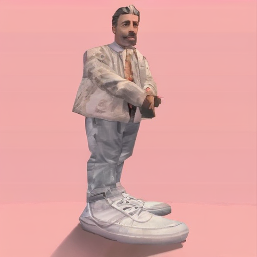
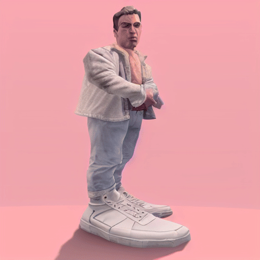
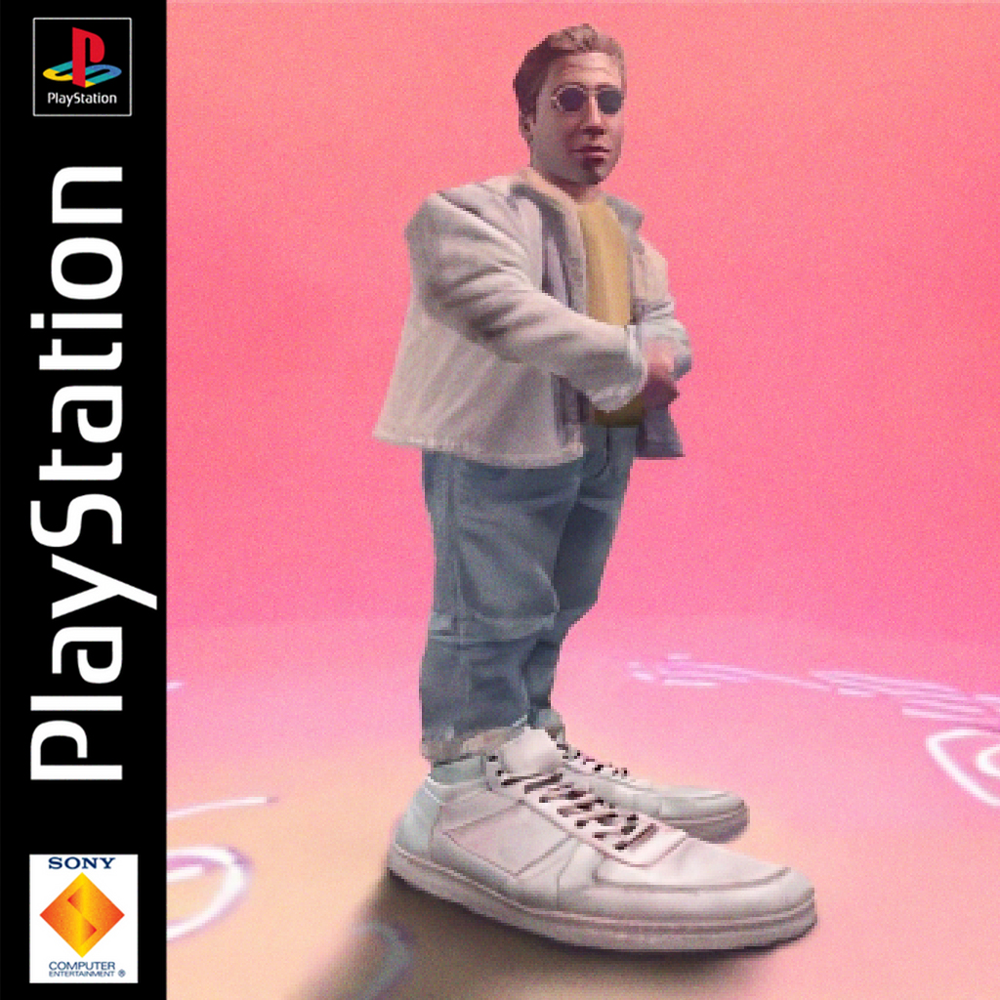

The idea was to jump the trend of creating oldschool playstation styled photos

Already had a ridiculous profile picture with me with big sneakers standing on a pink background, the prime candidate to amp it up further.

Original prompt used midjourney (link to og prompt)

But could i run it myself? Good way to utilize the g9 server in the homelab as the 3070 on the gaming computer may not have enough vram for larger models and why stress the gaming machine if i could use the server with 256gb ram in the background

Link to webui docker

Automatic1111 and comfy UIs

Different models, parameters

Using sd1.5

First aha: CFG

Got background and ground:
man big shoes light clothes sunglasses ps1 playstation psx gamecube game radioactive dreams screencapture 3d pixelated
Steps: 80, Sampler: LMS, CFG scale: 16, Seed: 2788379268, Size: 512x512, Model hash: c6bbc15e32, Model: sd-v1-5-inpainting, Denoising strength: 0.75, Conditional mask weight: 1.0, Version: v1.7.0
00002-541820203.png

Switch to sdxl

Second aha: denoise strength
man big shoes light clothes hands crossed <lora:sdxl-psx:1.2> low poly playstation 1 still
Steps: 30, Sampler: DPM++ 2M SDE Karras, CFG scale: 9, Seed: 2955775176, Size: 512x512, Model hash: d8fd60692a, Model: sdxl-helloworld-xl, Denoising strength: 0.3, Lora hashes: "sdxl-psx: 97857fb508e5", Version: v1.7.0

First decent result

Third aha: controlnet

man big shoes light clothes hands crossed <lora:sdxl-psx:1.2> low poly playstation 1 still
Negative prompt: old beard mustache formal tie necktie
Steps: 20, Sampler: DPM++ 2M SDE Karras, CFG scale: 11, Seed: 1731225750, Size: 512x512, Model hash: c6bbc15e32, Model: sd-v1-5-inpainting, Denoising strength: 0.31, Conditional mask weight: 1.0, Lora hashes: "sdxl-psx: 97857fb508e5", Version: v1.7.0
Saved: 00013-1731225750.png

Img2img works best in tandem with the img also in a controlnet unit in my experience so that it preserves more of the original.

Cool lora, thanks to the creator LuisaP!

Steps: 24, Sampler: DPM++ 2M Karras, CFG scale: 8, Size: 512x512, Model hash: d8fd60692a, Model: sdxl-helloworld-xl, Denoising strength: 0.3, Lora hashes: "sdxl-psx: 97857fb508e5", Version: v1.7.0

ControlNet Unit 0 model: diffusers_xl_canny_full, pixel perfect: true, upload independent control image: true (same as img2img), control weight 1, control mode: controlnet priority

realistic, photoreal, highly detailed, (rich cat wearing gold chains), nightclub, dark, neon, contrast
Negative prompt: cartoon, unrealistic, anime
Steps: 21, Sampler: DPM++ 2M Karras, CFG scale: 7, Seed: 810480089, Size: 512x512, Model hash: d8fd60692a, Model: sdxl-helloworld-xl, ControlNet 0: "Module: depth_midas, Model: diffusers_xl_depth_full [e3b0c442], Weight: 0.9, Resize Mode: Just Resize, Low Vram: False, Processor Res: 512, Guidance Start: 0, Guidance End: 1, Pixel Perfect: True, Control Mode: Balanced, Hr Option: Both, Save Detected Map: True", Version: v1.7.0
controlnet 0: depth 

then separate face 

<lora:sdxl-psx:1.2> man smug face thin closeup portrait low poly playstation 1 still
Negative prompt: old, old man, sad, angry, beard, mustache
Steps: 30, Sampler: DPM++ 2M SDE Karras, CFG scale: 7, Seed: 1223703963, Size: 512x512, Model hash: d8fd60692a, Model: sdxl-helloworld-xl, Denoising strength: 0.4, Lora hashes: "sdxl-psx: 97857fb508e5", Version: v1.7.0
Saved: 00020-1223703963.png

Photoshop process gif with previosly mentioned pics

add noise, grain and pixellate, final result:

