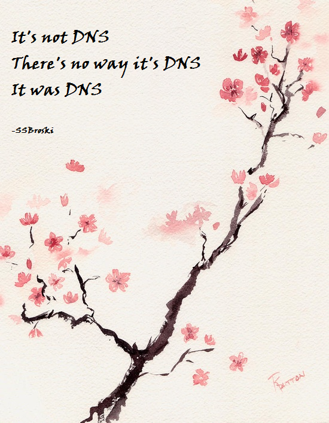

!!! info "Site Sources"
    Created with [Mkdocs](https://www.mkdocs.org/)

    Beautified with [Material](https://squidfunk.github.io/mkdocs-material/)

    Hosted on [GitHub Pages](https://pages.github.com/)

    Domain from [NameCheap](https://namecheap.com)

Not sure what else to put here, but for making it here, you shall be rewarded with a story I found on Reddit:

> People: "We must consult the technopriests about how to do the thing!"
>
> People to technopriests: "Oh venerated guardians of the ancient wisdom of the all-knowing Search Engine, we come to you for advice on how to do the thing! As a token of our appreciation for your utterly obfuscated divine art, we bring you a cup of coffee, so that you may perform your ceremonies without falling asleep"
>
> Technopriests to people: "Your offering is acceptable. We shall feast on it and then consult with the mighty ancient Search Engine on how to do the thing!"
>
> The technopriests ingest the liquid and walk down into the basement of ancient wisdom and knowledge. A small box sits there, with status light glowing and fading, as if breathing.
>
> Technopriests: "O mighty Godgle, how do we do the thing?"
>
> Godgle, the box of all knowledge: "You do the thing by doing it, not by not doing it"
>
> Technopriests: "We thank you for this wisdom oh mighty Godgle"
>
> The technopriests resurface.
>
> Technopriests to people: "We have received divine wisdom from the mighty Search Engine and it has told us that you may do the thing by doing it instead of not doing it!"
>
> People: "Truly, we could never have figured this out ourselves"
>
> And so the people did the thing instead of not doing the thing and humanity was saved once more.

