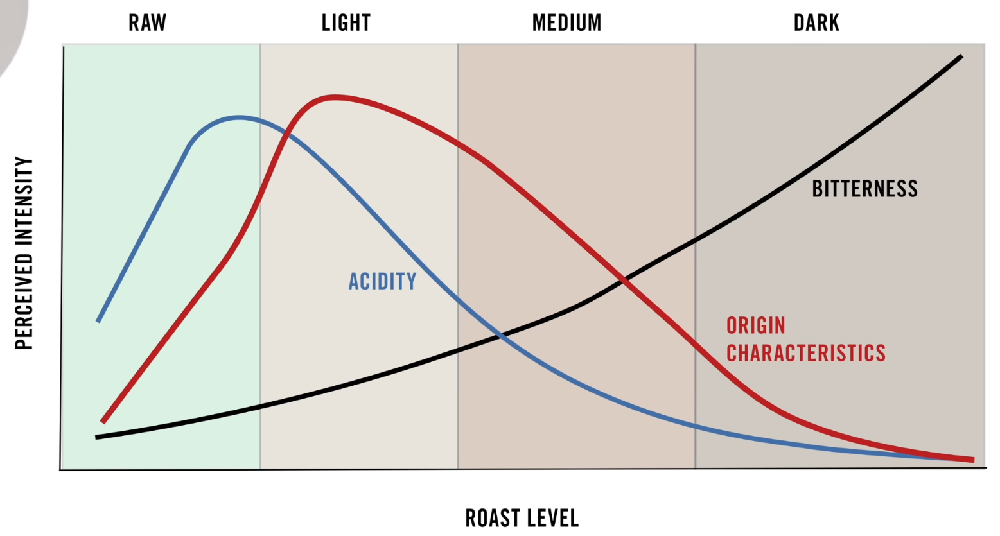
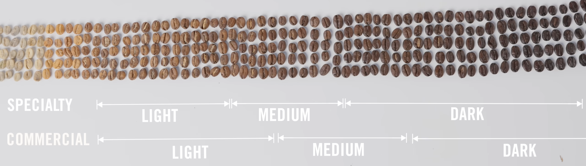

Notes on coffee ☕

## Favorite Beans

Everyday:

- [OA No1](https://oa-coffee.com/product/heakohv/oa-no1/)

Special:

- [Ristretto](https://www.facebook.com/ristrettocafemovil/) - Pache (espresso, iced, universal)
- [Brew Brothers Specialty Coffee](https://www.instagram.com/brewbros_cafe) - Bourbon Rojo (espresso)
- [Cafe Amaia Zagrado](https://amaiazagrado.wordpress.com/) (light columbian espresso, extremely chocolatey and fruity even in espresso form)
- [DAK](https://www.dakcoffeeroasters.com/) - Halo Berry (dark roast acidic berry splash)

Best of the best:

- [Father Carpenter](https://fathercarpenter.com/) - Peru honey ferment light roast (velvety and delicate)

Emergency:

- [Lavazza Crema E Aroma](https://www.lavazza.com/en/coffee-beans/crema-aroma)

## Roast guide





## Grind guide

Kingrinder K6 settings [rough guide](https://honestcoffeeguide.com/kingrinder-k6-grind-settings/).

## Pourover techniques

General notes applicable to all techniques:

- Hot brown water, lack of taste or sour means too coarse. If bitter then too fine.
- 2:30 is usually too fast, try to hit a soft target around 3-3:30 for draw down time. Finer if faster, coarser for too slow.
- The closer you pour the deeper the stream penetrates the coffee, the closer the pour the more consistent the extraction
- 5g/s is a nice sweet spot for pouring speed
- Pouring kettle can help for a sharper and more consisten stream but should not be needed
- The slower the paper the fuller the extraction, with modern filters rinsing is not required

### Hoffman 1 Cup V60 Method

From: [A Better 1 Cup V60 Technique](https://youtu.be/1oB1oDrDkHM) - James Hoffmann

- 15g ground coffee
- 250g boiled water 80-85°C dark, 90-95°C medium, 100°C light
- Grind: medium-fine (coarser for darker roast)

Examples with Kingrinder K6:

- CapriSette - Belgique "medium-light" dark roast, 57-60~ clicks (55 too bitter, over 65 sour and watery), 95-97°C
- CapriSette - Professional "medium-dark" dark roast, 60-63~ clicks, 90°C
- DAK - Halo Berry dark roast, 75-80 clicks 85°C
- Lykke - Peru Agua de Nieve light roast 65 clicks, 100-97°C
- Father Carpenter - Peru honey ferment light roast: 53-55 clicks, 98-100°C (60 too sour)

Recipe:

1. **0m00s**: Pour 50g of water to bloom
2. **0m10s - 0m15s**: Gently Swirl
3. **0m15s - 0m45s**: Bloom
4. **0m45s - 1m00s**: Pour to 100g total (40%)
5. **1m00s - 1m10s**: Pause
6. **1m10s - 1m20s**: Pour to 150g total (60%)
7. **1m20s - 1m30s**: Pause
8. **1m30s - 1m40s**: Pour to 200g total (80%)
9. **1m40s - 1m50s**: Pause
10. **1m50s - 2m00s**: Pour to 250g total (100%)
11. **2m00s - 2m05s**: Gently swirl
12. Drawdown should finish around 3:00~

Stronger variant (by grinding "too fine"):

- Everything the same, but grind way finer
- At the end remove the cup at around 3:00~ like usual and leave the rest to drip away
- Ideally you would have 215-220g of coffee at the end (as opposed to usual method which leaves you with 250g)

If grind was too coarse:

- Increase amount of pours (split total weight into more chunks)
- Wait to drip completely between pours
- You can also increase speed to extract a little more
- Add additional 50g pour on top of the usual 250g to extract even more (this makes taste weaker too though)

## Aeropress techniques

### Regular AeroPress

This recipe [calls for a fine grind](https://aeroprecipe.com/recipes/james-hoffmann-aeropress-recipe), nearing espresso grind levels and is built around the **paper filter only**. Using the regular filter holder and regular paper filter, it will underextract in the beginning like every other non-inverted AeroPress recipe.

Warning when using only the metal filter: you will find it too bitter even at double coarseness of pourover (100 clicks or more with Kingrinder K6) and 95°C and might find some sour notes too, this is due to the metal filter not holding enough in when seeping and pushing.

Examples with Kingrinder K6:

- Father Carpenter - Kenya light roast:
    - with metal and paper filter: 35-25 clicks, 97-100°C still too sour
    - with paper filter only: 38 clicks, 97-100°C (35 clicks too bitter, 45 too sour) 
- Lykke - Peru Agua de Nieve light roast:
    - with paper filter only: 34 clicks, 100°C

Recipe:

1. 11g coffee (ground at the finer end of medium, assuming this is light roasted coffee. The darker you go the more you may prefer to increase the dose and coarsen the grind.)
2. Put the paper filter into the cap (or use metal *and* paper filter, both). Don't rinse or preheat the brewer (it doesn't make any difference)
3. Put coffee into the brewer
4. Place on scales and then add water, aiming to wet all the coffee during pouring. 200g water (100°C for light, 90-95°C medium, 85-90°C dark)
5. (Optional) Stir if it seems clumped
6. Start a timer, and immediately place the piston piece into the top of the brewer, about 1cm in
7. Wait 2 minutes (but you may go up to 8-10 minutes)
8. Holding the brewer and the piston, gently swirl the brewer
9. Wait 30s
10. Press gently all the way (should take 30-60s)

### Inverted AeroPress

Inverted method for "espresso-like", more stronger taste. This also results in a more uniform taste compared to regular AeroPress method which underextracts in the beginning. 18g beans results in 36-40g of coffee from an espresso machine, 65 to 70g of coffee from immersion techniques to get something "espresso-like".

**This recipe is made for dark and medium roasts**, light roast will come out sour even with more stirring and steeping time.

Paper filter preferred, but metal or both together also work.

Examples with Kingrinder K6:

- CapriSette - Belgique "medium-light" dark roast:
    - with metal filter: 40 clicks
    - with paper filter: 45-50 clicks
- CapriSette - Professional "medium-dark" dark roast:
    - with metal filter: 40 clicks
- DAK - Halo Berry dark roast:
    - with metal filter or paper filter only: 35 clicks (40 clicks too sour)

Recipe:

1. Add 18g finely ground coffee
2. Add 90g of boiled water
3. Stir carefully but a little agressively to make sure all of the coffee is immersed
4. Screw the filter on and steep for 90s
5. Put cup on filter and flip the press with the cup
6. Swirl to clear clumped sides
7. Sit for 5s
8. Press gently (slowly enough to not create a channel that would underextract)
9.  Press til the final end (unlike traditional AeroPress recipe)
10. (Optional) Add 100ml of prepared milk OR 100-160ml of 80°C water to get it closer to a pourover

### Zuppa Lunga AeroPress

Otherwise known as SOUP (es**S**presso, **O**nly **U**n**P**ressurized, and yeah, this acronym's a bit stupid) or the "oreo method".

This method tries to avoid any extra agitation from water pours to extract as much coffee essence/nectar without any astringency, so it works best with fruity, sweet, extra process light roasts.

Examples:

- Father Carpenter - Peru honey ferment light roast: 
    - without "sour pass": 28 clicks, 98-100°C (27 too bitter, 30 too sour)
    - with "sour pass": 28 clicks, 98-100°C too bitter
- Lykke - Peru Agua de Nieve light roast: 35 clicks, 98°C (30 too bitter)

Recipe:

1. Put the paper filter into the cap, screw the cap on
2. Drop in 15g of coffee, slightly coarser than espresso
3. Tap and shake to level the grinds
4. Tamp with a second paper filter using the plunger, remove carefully to avoid air turbulence messing up the tamped grinds and filter
5. (Optional "sour pass") Add 10-15g room temp water, push it out with plunger in at around 1-2cm, down until top filter looks dry-ish, then take plunger out again and dump the resulting sour extraction
6. (Optional) Drop in a metal filter to avoid the second filter from floating up (higher the temp, the more likely this will happen due to more CO2 release)
7. Pour 150g of water, optionally using a long spoon/object to soften the water's fall even further
8. Add plunger, and do a slow plunge, around 60-120s

## Immersion technique

### French press

1. Grind medium
2. Add 30g to 500g water 
3. Sit for 4 minutes
4. Stir crust and then scoop up foam and coffee bits off the top
5. Wait 5-8 minutes
6. Plunge just to underneath the surface and pour gently and carefully.

## Moka pot technique

Constants:

1. Boiling water in the boiler
2. Full basket of coffee
3. Avoid sputtering phase by cooling down the chamber under cold water

Variables:

1. The lighter the roast, the finer the ground.
2. Less filled boiler will brew a bit earlier. Usually, dark roasts -> a bit less water, light roasts -> full boiler
3. Add aeropress filter if possible

Recipe:

1. Fill lower compartment to the safety valve
2. Fill the coffe compartment
3. Preheat the hob with relatively low heat on the gas hob
4. Assemble the pot and wait
5. As soon as the liquid starts to flow, turn off the heat. For electric hobs, move it to the edge of the hob.

Troubleshooting, if the sputtering phase starts before you think it's time (not enough coffee out etc):

1. Too fine of a grind 
2. Too much heat

## Milk techniques

Overall milk at 55-65°C, 55°C usually more sweeter. Milk breaks at about 70°C, definitely avoid that.

More fat = better foam usually

Pourover ratio around 200g coffee, 50g milk

### Chiato Milkplay

100ml is between MIN line and lower MAX line.

Setting diagram:

```
 2 | 3
---+---
 1 | 4
```

1. Warm, firm milk foam (faster spin)
2. Warm, creamy milk foam (slower spin)
3. Hot chocolate drink (aka mixing mode, even more slow)
4. Cold milk foam 

Simple latte macchiato, cappucino with thicker foam: 

1. Use setting 2 with spring attachment
2. Stop foaming just before reaching auto stop (1:42s) to have it more sweet

Microfoam-ish (not quite, but servicable):

1. Use flat attachment, set at a slight lean on one side, use fatter milk
2. 1m37s with setting 2, 30s with setting 4

### Subminimal Nanofoamer

Italian technique:

1. One finger between base and pitcher, slight angle (~30deg) 15s
2. Tap and swirl
3. Transfer to temporary cup and then back to pitcher (so as to mix milk and foam so they won't separate)
4. Pour immediately

Official technique:

1. Start at the centre, barely in at a slight angle (30deg), 5s
2. Go deeper and slowly towards the edge while keeping a vortex, until sound of milk is more quiet, about 20s (in this stage avoid making any new bubbles!)

### Chiato Milkplay and Subminimal Nanofoamer combined

This recipe leverages the Milkplay to do the airation consistently and the Nanofoamer to achieve the nanofoam.

1. Fill Milkplay with 100-150ml of milk
2. Use flat attachment with setting 1 until milk is at 55°C
3. Transfer to pitcher
4. Use the Nanofoamer, one finger between base and pitcher, slight angle (~30deg) 15s
5. Tap and swirl
6. (Optional) Transfer back to Milkplay and then back to pitcher again (this results in more uniform milk)
7. Pour

## Recipes

**Espresso tonic**:

- Espresso
- Tonic Water
- Blueberry Simple Syrup
- Ice
