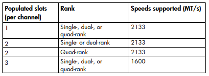
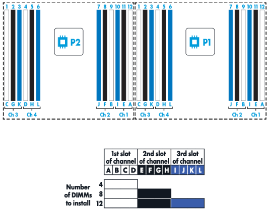

!!! info
    

## Disks, CPUs and RAM

I was able to obtain a single HP DL380 G9 with a truckload of spare RAM, disks and CPUs. More precisely, the whole array of parts to choose from consisted of 55x 600gb 10K SAS disks, 42x 16GB dual rank ECC DDR4 2133CL15 RAM sticks and 18x Intel Xeon E5-2630 v3 CPUs.

For CPUs and disks it was quite easy: slot in as much as the board could fit. Which in my case amounted to 2 CPUs and then 8 disks since I only had one of the three possible drive bays installed on the board.

For RAM, however nice it sounded to fill all 24 slots and enjoy 384GB of memory, there was some additional consideration since these CPUs each have four independent memory channels. For best performance, all four memory channels of each CPU should be populated with identical DIMM setup to allow parallel access across the entire memory bus. This means installing 8, 16, or 24 DIMMs total. However populating all three sockets per memory channel, i.e. all 24 slots, memory controller significantly lowers the frequency as detailed in [NUMA Deep Dive Part 4: Local Memory Optimization](https://frankdenneman.nl/2016/07/13/numa-deep-dive-4-local-memory-optimization/).

As more ranks are used in a memory channel, memory speed is dropped to make up for the management overhead. Therefore in certain configurations, DIMMs will run slower than their listed maximum speeds. This is also documented in DL380 G9 User Manual:

Using 24x16GB would drop the memory speed from 2133MHz to 1600MHz, a quite significant drop. Assuming that I wanted to run some game servers on this server I went with lower capacity, 16x16GB, and thus with higher speed thinking that 16 cores split over 8 VMs would give each VM 2 cores (if not over-committing as should be done) and 32GB (realistically 31GB to leave room for hypervisor) of memory which would be sufficient. I left the third slots of the channels empty as per the user manual:

## Booting and BIOS settings

First order of business was to boot and replace any faulty RAM sticks, which I found 1 of. Having fixed that I made sure that virtualization was enabled and power saving or throttling settings were disabled. Also made sure to reset the ILO management details of the previous owner so I could access it with the default credentials and set my own.

I then made my way over to the HP Smart Storage Administrator where I configured the 8 physical disks into 4 logical volumes in RAID1, giving me 4x600GB volumes to work with. This gave me the ability to hot-swap out any faulty disks on the go. Because of the limiting size of the disks I decided to forgo unconfigured disks standby for disaster recovery hoping that any of the 4 logical volumes would not fault at quick succession.
