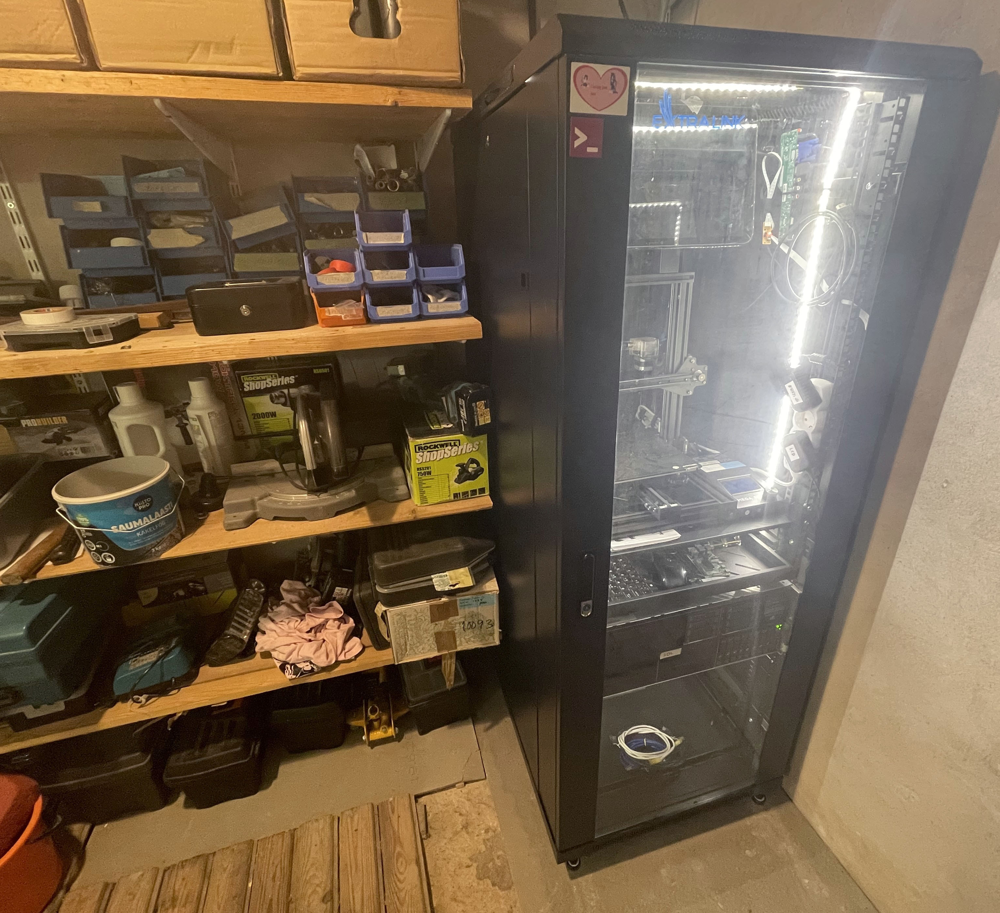
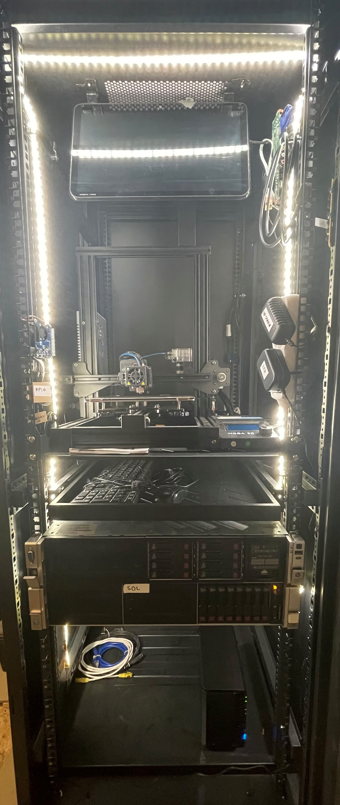
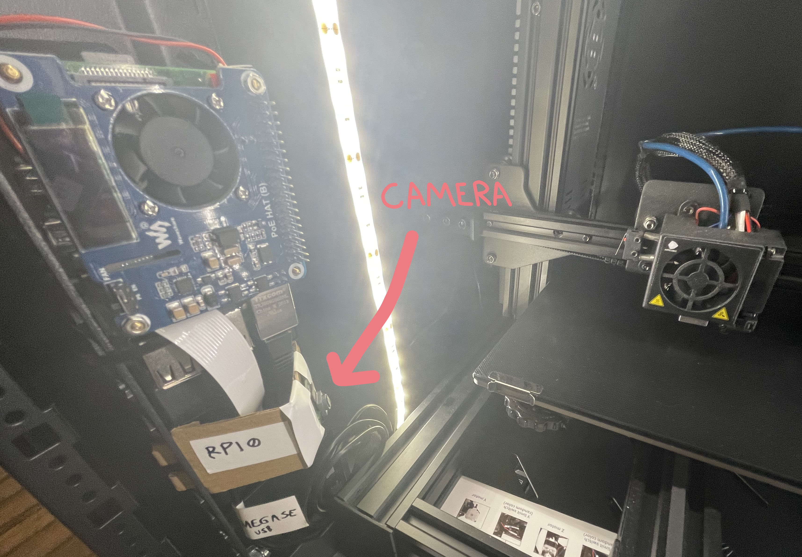
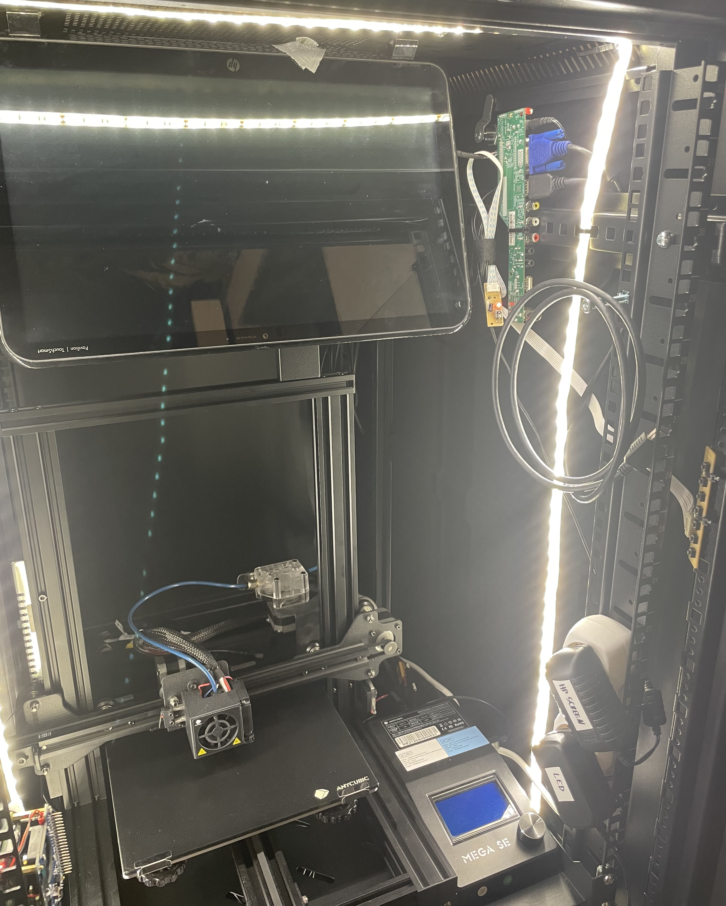
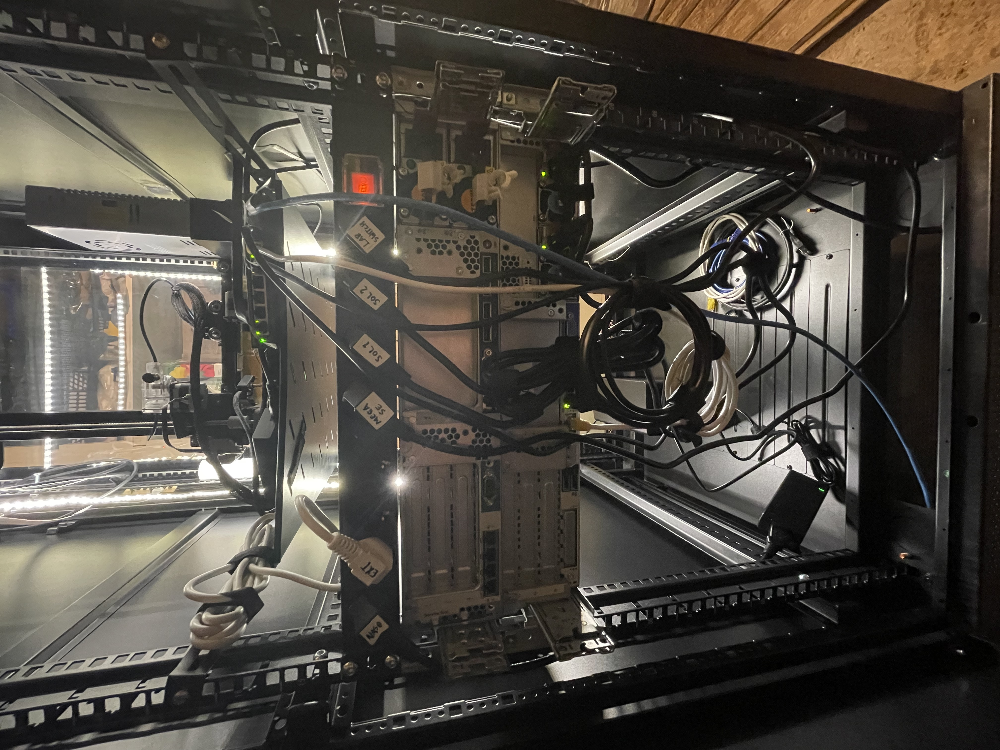
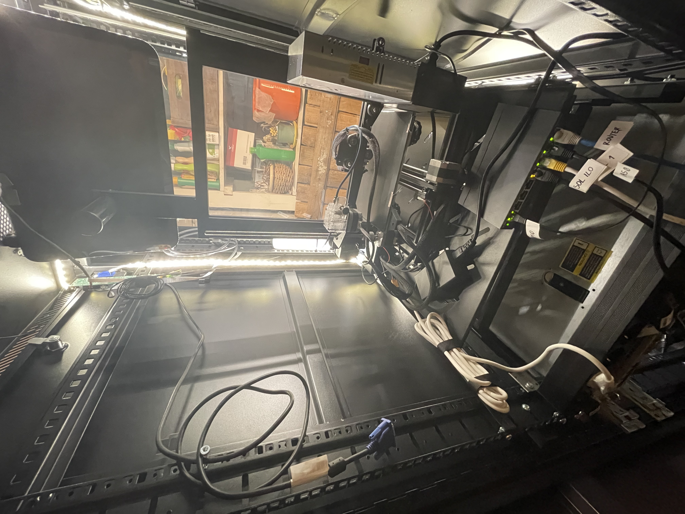
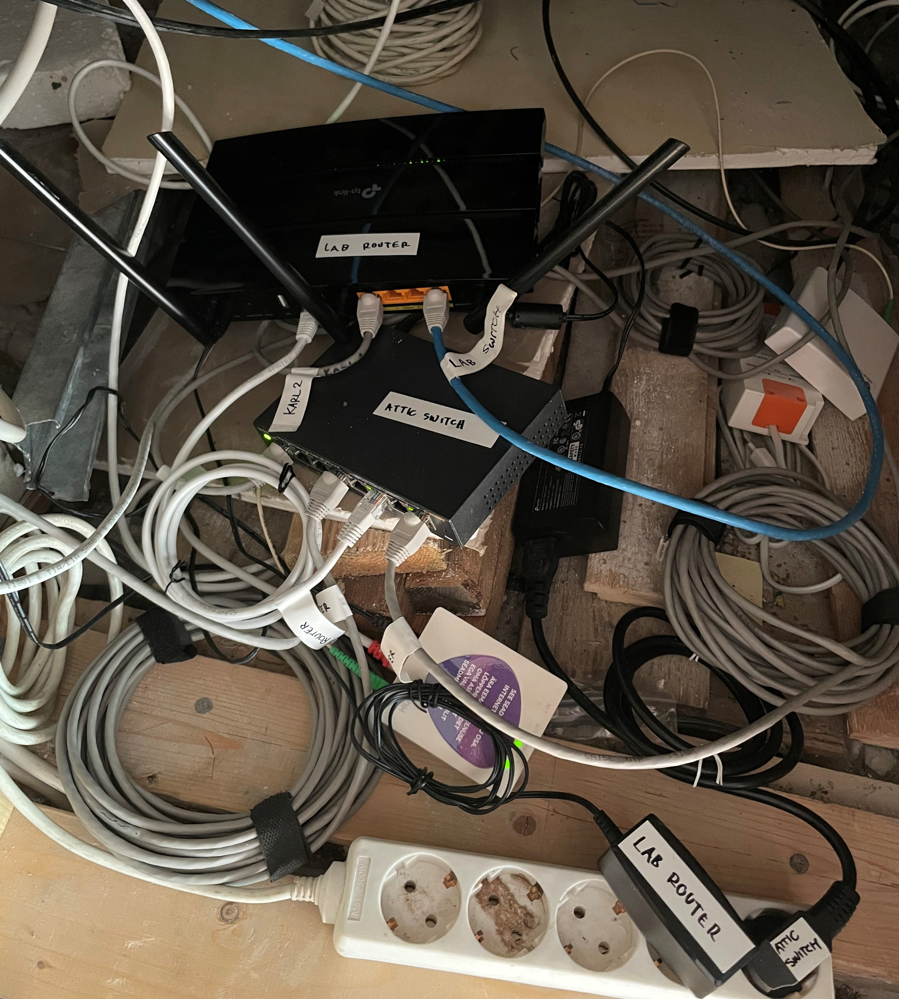

Anything directly related to the homelab infrastructure is documented in this section.

!!! info
    A [homelab](https://old.reddit.com/r/homelab/) is self-hosted infrastructure at home for:

    - experimenting in a safe environment and learning technologies.
    - running personal "production" services (like game servers, file cloud etc).

## Hardware

Latest full list of hardware used in the JamLab homelab is available on my personal site's [Setup page](https://jamfox.dev/setup). Other sections in documentation may only reference bits and pieces of the setup.

## Pictures

### Rack - Outer

### Rack - Front

### Rack - Back

### Attic

