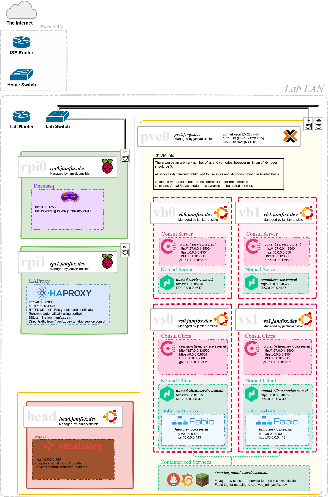
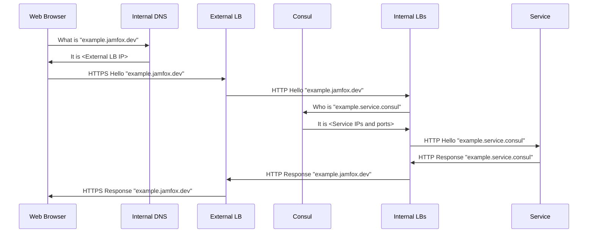

## JamLab Nomad Architecture

JamLab was the first, now mostly deprecated experiment to fool around with IaC concepts and Hashicorp Nomad. This page describes the JamLab Nomad architecture.

### Abstract overview

JamLab is a hardware installed at JamFox's home, the lab is behind switch that is connected to the NAT gateway router with a dynamic IP and is managed by one or more [Proxmox Virtual Environment](https://www.proxmox.com/en/proxmox-ve) bare metal hypervisor hosts with a heap memory and CPU resources for running virtual machines. Internal DNS is provided by another low-power always-on bare metal host, in this case a Raspberry Pi. All bare metal hosts are configured using [Red Hat Ansible](https://www.ansible.com/). Secrets are handled by [Ansible Vault](https://docs.ansible.com/ansible/latest/cli/ansible-vault.html). Hypervisor host runs virtual machines. Configured virtual machine templates are built with [Hashicorp Packer](https://www.packer.io/) and provisioned using [Hashicorp Terraform](https://www.terraform.io/) and configured by Ansible post-provision. Virtual machines fall into two groups: base infrastructure nodes (called `vb` nodes) and service infrastructure nodes (called `vs` nodes). Base infrastructure nodes run [Hashicorp Consul service discovery](https://www.consul.io/), [Hashicorp Nomad orchestration servers](https://www.hashicorp.com/products/nomad). Service infrastructure nodes use Nomad clients to run containerized services.

Features:

- Dynamically parsed hosts list: adding a new `vs` and `vb` nodes is as easy as adding a new entry to their respective host groups.
- Reproducible VM provisioning: Packer creates VM template and Terraform provisions VMs.
- Internal DNS: reach nodes via subdomain instead of trying to remember IPs.
- External DNS: internet-exposed services available with DDNS pointing to router or by using Cloudflare Tunnels.
- Load balancing dynamic services: HAProxy as the external load balancer forwards traffic to live internal load balancers integrated with Consul service discovery that forward to appropriate dynamic service hosts and ports.  
- Nomad orchestration: host any service and orchestrate it.
- Consul service discovery: services with multiple instances discoverable from `<service name>.service.consul` address.
- Consul Connect service mesh: Nomad services are able to securely communicate with each other with no manual plumbing configuration.
- NFS shared storage: for general shared storage and Nomad stateful storage.

JamLab repositories:

- [jamlab-ansible](https://github.com/JamFox/jamlab-ansible): Homelab bootstrap and pull-mode configuration management with Ansible and bash.
- [jamlab-packer](https://github.com/JamFox/jamlab-packer): Packer configurations for building homelab images.
- [jamlab-terraform](https://github.com/JamFox/jamlab-terraform): Terraform configurations for provisioning homelab VMs.

### Overview diagram




## Accessing services

Let's say that the client wishes to access a web server from the address `example.jamfox.dev`.

If the client queries `example.jamfox.dev`:

- from outside the JamLab internal network they get back a response from external DNS (eg Namecheap DNS, Cloudflare DNS or other) pointing to a dynamic IP of the JamLab ISP router. The JamLab ISP router forwards ports to the bastion host running HAProxy.
- from inside the JamLab internal network then they get back a response from the internal DNS pointing to the bastion host running HAProxy.

HAProxy establishes connection and terminates SSL if used. By default, HAProxy balances and directs the traffic to Fabio load balancers on `vs` nodes. If Fabio finds any Nomad services that have been tagged with the address `example.jamfox.dev` it will balance and direct the traffic to the service node(s).

```
                      +- HTTP(S) -> Fabio LB -+-> example-0 (vs0)
                      |                       |
HTTPS --> HAProxy LB -+- HTTP(S) -> Fabio LB -+-> example-1 (vs1)
                      |                       |
                      +- HTTP(S) -> Fabio LB -+-> example-n (vsn)
```

Sequence diagram of the communications needed to create a successful communication from a client to a containerized service:


